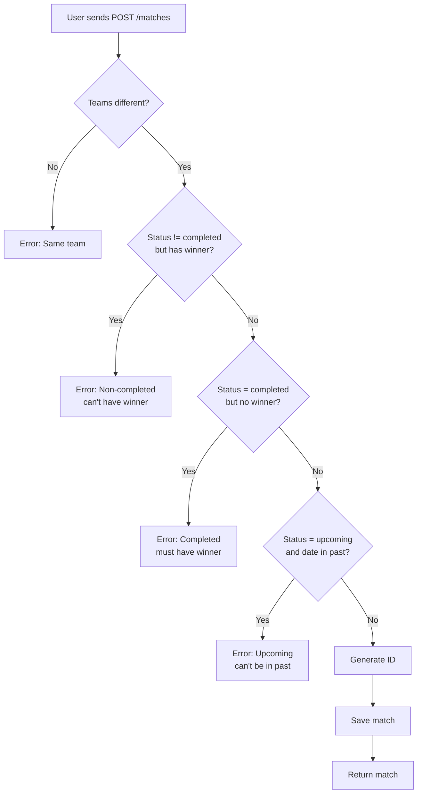

import { Callout } from 'fumadocs-ui/components/callout';

# POST Validation and Business Rules

Our GET filters are solid, but the POST endpoint still accepts invalid data. Let's fix that.

## What Can Go Wrong?

Try creating these matches in `/docs`. Each one passes Pydantic's type checks but violates a real-world rule.

### Test 1: Same Team vs Itself

```json title="❌ Arsenal vs Arsenal"
{
  "id": 99,
  "home_team": "Arsenal",
  "away_team": "Arsenal",
  "sport": "football",
  "date": "2026-05-01",
  "status": "upcoming"
}
```

**It's accepted.** Arsenal vs Arsenal. That's nonsense.

---

### Test 2: Upcoming Match with Winner

```json title="❌ Future match already decided"
{
  "id": 100,
  "home_team": "Real Madrid",
  "away_team": "Barcelona",
  "sport": "football",
  "date": "2026-06-01",
  "status": "upcoming",
  "winner": "home_team"
}
```

**It's accepted.** The match hasn't happened yet, but Real Madrid already won?

---

### Test 3: Upcoming Match in the Past

```json title="❌ 'Upcoming' match from 2020"
{
  "id": 101,
  "home_team": "Lakers",
  "away_team": "Celtics",
  "sport": "basketball",
  "date": "2020-01-01",
  "status": "upcoming"
}
```

**It's accepted.** An "upcoming" match scheduled for 2020.

---

<Callout type="error" title="Pydantic Can't Help Here">
  Pydantic validates **types**:
  - Is `home_team` a string? ✓
  - Is `status` a valid enum? ✓
  - Is `date` a real date? ✓

  But it doesn't understand **relationships between fields**:
  - `home_team` ≠ `away_team`
  - `status=upcoming` → `winner=None`
  - `status=upcoming` → `date >= today`

  These are **business rules** — rules about what makes sense in your specific domain. You have to code them yourself.
</Callout>

---

## Rule 1: Teams Must Be Different

Start with the simplest rule. Before saving anything, check if the teams are the same:

```python title="matches.py"
@app.post("/matches", tags=["Matches"])
def create_match(match: Match):
    if match.home_team == match.away_team:  # !mark
        return {"error": "Both teams cannot have the same name"}  # !mark

    INITIAL_DATA.append(match)
    return match
```

<Callout type="info" title="Validation Before Insertion">
  We check the data **before** adding it to `INITIAL_DATA`. If it's invalid, we return an error and the list is never touched. This is the "validate then write" pattern — always validate before mutating state.
</Callout>

Now try creating Arsenal vs Arsenal:

```json title="Validation error"
{
  "error": "Both teams cannot have the same name"
}
```

---

## Rule 2: Non-Completed Matches Can't Have Winners

Only completed matches should have a winner. Upcoming, cancelled, or abandoned matches shouldn't — the game hasn't been decided yet:

```python title="matches.py"
@app.post("/matches", tags=["Matches"])
def create_match(match: Match):
    if match.home_team == match.away_team:
        return {"error": "Both teams cannot have the same name"}

    if match.status != Status.completed and match.winner is not None:  # !mark
        return {"error": "Only completed matches can have a winner"}  # !mark

    INITIAL_DATA.append(match)
    return match
```

### Understanding the Logic

```python title="Breaking down the condition"
if match.status != Status.completed and match.winner is not None:
    #   ^^^^^^^^^^^^^^^^^^^^^^^^^^^^    ^^^^^^^^^^^^^^^^^^^^^^^^
    #   Status is NOT completed         AND winner was provided
    #   (upcoming, cancelled, abandoned)
    #
    #   Both conditions must be true to trigger the error.
    #   If status IS completed → condition is false, no error.
    #   If winner IS None → condition is false, no error.
```

Try creating an upcoming match with `"winner": "home_team"`:

```json title="Validation error"
{
  "error": "Only completed matches can have a winner"
}
```

---

## Rule 3: Completed Matches MUST Have Winners

The opposite is also true — if a match is completed, it must declare a winner. Even draws count as a winner value (`Winner.draw`):

```python title="matches.py"
@app.post("/matches", tags=["Matches"])
def create_match(match: Match):
    if match.home_team == match.away_team:
        return {"error": "Both teams cannot have the same name"}

    if match.status != Status.completed and match.winner is not None:
        return {"error": "Only completed matches can have a winner"}

    if match.status == Status.completed and match.winner is None:  # !mark
        return {"error": "Completed matches must have a winner"}  # !mark

    INITIAL_DATA.append(match)
    return match
```

Try creating a completed match with no winner:

```json title="Missing winner"
{
  "id": 99,
  "home_team": "Arsenal",
  "away_team": "Chelsea",
  "sport": "football",
  "date": "2025-10-21",
  "status": "completed"
}
```

Response:

```json title="Validation error"
{
  "error": "Completed matches must have a winner"
}
```

<Callout type="info" title="Why require winner even for draws?">
  Even if the match ended in a draw, you must specify `"winner": "draw"`. This makes the data unambiguous — a `null` winner might mean "nobody won" OR "we forgot to record it." Requiring an explicit value removes that ambiguity entirely.
</Callout>

---

## Rule 4: Upcoming Matches Can't Be in the Past

`date.today()` returns today's server date. We use it to check that future-scheduled matches are actually in the future:

```diff title="matches.py"
+ from datetime import date

  # ... rest of imports ...


  @app.post("/matches", tags=["Matches"])
  def create_match(match: Match):
      # ... other checks ...

+     if match.status == Status.upcoming and match.date < date.today():
+         return {"error": "Upcoming matches cannot be scheduled in the past"}

      INITIAL_DATA.append(match)
      return match
```

Try creating an upcoming match with `"date": "2020-01-01"`:

```json title="Validation error"
{
  "error": "Upcoming matches cannot be scheduled in the past"
}
```

<Callout type="warn" title="Why date.today()?">
  `date.today()` returns the current date on the **server**. This means validation depends on when the server runs — a date that's valid today might become invalid tomorrow. In production, you'd use UTC time to avoid timezone inconsistencies.
</Callout>

---

## Rule 5: Auto-Generate IDs

Right now, users can send any `id` they want. That creates a collision risk — what if they send `id: 1`? Now we have two matches with the same ID, and any lookup by ID becomes unreliable.

**Solution:** Ignore the user's ID and generate a new one on the server:

```python title="matches.py"
@app.post("/matches", tags=["Matches"])
def create_match(match: Match):
    if match.home_team == match.away_team:
        return {"error": "Both teams cannot have the same name"}

    if match.status != Status.completed and match.winner is not None:
        return {"error": "Only completed matches can have a winner"}

    if match.status == Status.completed and match.winner is None:
        return {"error": "Completed matches must have a winner"}

    if match.status == Status.upcoming and match.date < date.today():
        return {"error": "Upcoming matches cannot be scheduled in the past"}

    # Auto-generate ID — always one higher than the current last match
    new_id = INITIAL_DATA[-1].id + 1  # !mark
    match.id = new_id  # !mark

    INITIAL_DATA.append(match)
    return match
```

<Callout type="info" title="INITIAL_DATA[-1]">
  In Python, `[-1]` accesses the **last element** of a list. So `INITIAL_DATA[-1].id` is the ID of the most recently added match. Adding 1 gives us a unique new ID. This is a simplified pattern — real databases have auto-increment columns that handle this automatically.
</Callout>

<Callout type="info" title="Real Databases">
  In production, you'd use a database with auto-incrementing IDs (PostgreSQL's `SERIAL`, SQLite's `INTEGER PRIMARY KEY`, etc.). The database manages uniqueness for you. This manual approach is fine for learning but don't use it in production.
</Callout>

---

## Complete POST Endpoint

Here's the final version with all five rules and comments explaining each:

```python title="matches.py"
@app.post("/matches", tags=["Matches"])
def create_match(match: Match):
    # Rule 1: Teams must be different
    if match.home_team == match.away_team:
        return {"error": "Both teams cannot have the same name"}

    # Rule 2: Non-completed matches can't have winners
    if match.status != Status.completed and match.winner is not None:
        return {"error": "Only completed matches can have a winner"}

    # Rule 3: Completed matches must have winners
    if match.status == Status.completed and match.winner is None:
        return {"error": "Completed matches must have a winner"}

    # Rule 4: Upcoming matches can't be in the past
    if match.status == Status.upcoming and match.date < date.today():
        return {"error": "Upcoming matches cannot be scheduled in the past"}

    # Rule 5: Auto-generate ID — ignore whatever the user sent
    new_id = INITIAL_DATA[-1].id + 1
    match.id = new_id

    # All rules passed — save and return
    INITIAL_DATA.append(match)
    return match
```

---

## Testing the Validation

Try each invalid case in `/docs`:

| Invalid Data | Error Message |
|--------------|---------------|
| `home_team = away_team` | "Both teams cannot have the same name" |
| `status=upcoming, winner=home_team` | "Only completed matches can have a winner" |
| `status=completed, winner=None` | "Completed matches must have a winner" |
| `status=upcoming, date=2020-01-01` | "Upcoming matches cannot be scheduled in the past" |

All caught before insertion. ✅

---

## What Pydantic Does vs What You Do

Here's a complete breakdown of the division of labour:

```python title="Type-level validation — Pydantic handles automatically"
sport: Sport          # Must be: football, cricket, hockey, basketball, baseball
status: Status        # Must be: upcoming, cancelled, abandoned, completed
winner: Winner        # Must be: home_team, away_team, draw (or None)
date: date            # Must be valid ISO 8601 date
id: int               # Must be an integer
home_team: str        # Must be a string
```

```python title="Business logic — you must handle manually"
home_team != away_team                    # Teams must differ
status != completed → winner = None       # Non-completed → no winner allowed
status = completed  → winner != None      # Completed → winner required
status = upcoming   → date >= today       # Upcoming → must be future
id = auto-generated                       # Server controls IDs
```

<Callout type="warn" title="Key Takeaway">
  **Type validation is automatic. Business logic validation is manual.**

  Pydantic ensures values are the right **type** and **format**. You ensure they make **logical sense** in your domain. Both layers are necessary for a robust API.
</Callout>

---

## Edge Cases to Consider

### Cancelled/Abandoned Matches

Should they have winners? Probably not — the match didn't finish normally. You could add:

```python title="Optional: Block winners for cancelled/abandoned"
if match.status in [Status.cancelled, Status.abandoned] and match.winner is not None:
    return {"error": "Cancelled or abandoned matches cannot have winners"}
```

### Past Completed Matches

Should you allow creating completed matches with past dates? **Yes** — you might be importing historical records:

```json title="✅ Valid historical record"
{
  "sport": "football",
  "date": "2010-01-01",
  "status": "completed",
  "winner": "home_team"
}
```

### Future Completed Matches

Should you allow creating completed matches with future dates?

```json title="❓ Suspicious but maybe valid?"
{
  "sport": "football",
  "date": "2030-01-01",
  "status": "completed",
  "winner": "home_team"
}
```

This is suspicious — how can a 2030 match already be completed? You could add:

```python title="Optional: Block future completed matches"
if match.status == Status.completed and match.date > date.today():
    return {"error": "Completed matches cannot be in the future"}
```

<Callout type="info" title="Your API, Your Rules">
  These edge cases depend on your domain. A historical sports database might allow backdated entries. A betting API might forbid them. **You decide based on your use case** — there's no universal right answer.
</Callout>

---

## Validation Flow

Here's how a POST request flows through all five checks:



---

## Summary: The Five Rules

```python title="Business validation checklist"
# 1. Teams must be different
if match.home_team == match.away_team:
    return {"error": "..."}

# 2. Only completed matches have winners
if match.status != Status.completed and match.winner is not None:
    return {"error": "..."}

# 3. Completed matches must have winners
if match.status == Status.completed and match.winner is None:
    return {"error": "..."}

# 4. Upcoming matches must be in the future
if match.status == Status.upcoming and match.date < date.today():
    return {"error": "..."}

# 5. Server generates IDs — don't trust user-supplied IDs
new_id = INITIAL_DATA[-1].id + 1
match.id = new_id
```

---

## What's Next

The validation works, but the `create_match` function is getting long. In the review lesson, we'll look at the full picture of what we've built and discuss how to take it further — real databases, pagination, authentication, and more.
