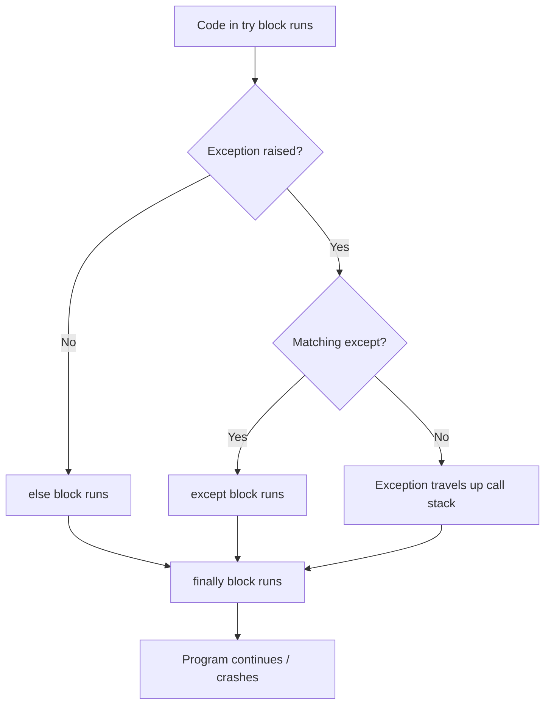

import { Callout } from 'fumadocs-ui/components/callout';

# Exceptions in Python

You've already been using exceptions without fully thinking about them:

```python
raise ValueError("home_team and away_team must be different")
raise HTTPException(status_code=404, detail="Match not found")
```

FastAPI and Pydantic caught those for you automatically. But outside of a framework, you need to handle exceptions yourself. This lesson covers everything — what they are, how they travel, and how to write your own.

---

## What Happens When Code Breaks?

Run this in Python:

```python
int("hello")
```

You get:

```
ValueError: invalid literal for int() with base 10: 'hello'
```

Python **raised an exception** — it created an error object, stopped execution, and reported what went wrong.

That error object has two parts:
- The **type** (`ValueError`) — what kind of error it is
- The **message** (`invalid literal...`) — what specifically went wrong

---

## Reading a Traceback

When an exception isn't caught, Python prints a **traceback** before crashing. Beginners often find these intimidating. They're actually very informative once you know how to read them.

```python
def calculate_average(numbers):
    return sum(numbers) / len(numbers)

def process_scores(scores):
    avg = calculate_average(scores)
    print(f"Average: {avg}")

process_scores([])
```

Output:

```
Traceback (most recent call last):
  File "main.py", line 8, in <module>
    process_scores([])
  File "main.py", line 5, in process_scores
    avg = calculate_average(scores)
  File "main.py", line 2, in calculate_average
    return sum(numbers) / len(numbers)
ZeroDivisionError: division by zero
```

**Read it from bottom to top:**

```
ZeroDivisionError: division by zero      ← 1. What went wrong
  return sum(numbers) / len(numbers)     ← 2. The exact line
  in calculate_average                   ← 3. Which function
  avg = calculate_average(scores)        ← 4. Who called it
  process_scores([])                     ← 5. Who called that
```

The bottom is the crash site. Working up tells you the call chain that got there.

<Callout type="info" title="The most useful part is the bottom">
  When you see a wall of traceback text, scroll to the very last line first. That's what went wrong. Then read upward to trace how your code got there.
</Callout>

---

## How Exceptions Travel: The Call Stack

When a function is called, Python adds it to the **call stack** — a chain of currently running functions. When an exception is raised, Python walks back up that chain looking for something to handle it.

```
process_scores() calls calculate_average()
  → calculate_average() raises ZeroDivisionError
  → No handler in calculate_average() → travels up
  → No handler in process_scores() → travels up
  → No handler anywhere → program crashes
```

If a handler is found at any level, the crash is stopped there and execution continues. If none is found anywhere, the program crashes with the traceback.

This travelling behaviour is what makes exceptions powerful — you raise an error deep inside a function, and handle it wherever makes sense, without passing error codes through every layer in between.

---

## Catching Exceptions with `try / except`

Wrap risky code in `try`. If it raises, the matching `except` block runs instead of crashing:

```python
try:
    value = int("hello")
    print("This line never runs")
except ValueError:
    print("That's not a valid number")

print("Program continues here")
```

Output:
```
That's not a valid number
Program continues here
```

The `try` block stops at the first exception. Everything after the failing line is skipped. After the `except` block, the program continues normally.

### Getting the exception message

Use `as e` to access the exception object:

```python
try:
    value = int("hello")
except ValueError as e:
    print(f"Error: {e}")
    print(f"Type: {type(e)}")
```

Output:
```
Error: invalid literal for int() with base 10: 'hello'
Type: <class 'ValueError'>
```

`str(e)` gives the human-readable message — which is exactly what you used in FastAPI: `detail=str(e)`.

### Catching multiple exception types

```python
def parse_id(raw):
    try:
        return int(raw)
    except ValueError:
        print(f"'{raw}' is not a valid integer")
        return None
    except TypeError:
        print(f"Expected a string, got {type(raw)}")
        return None

parse_id("3")     # works, returns 3
parse_id("abc")   # ValueError: 'abc' is not a valid integer
parse_id(None)    # TypeError: Expected a string...
```

Python checks each `except` clause in order and runs the first match.

Or catch multiple types in one line:

```python
except (ValueError, TypeError) as e:
    print(f"Bad input: {e}")
```

<Callout type="warn" title="Don't catch Exception broadly">
  `except Exception` catches nearly everything — including bugs like `NameError` (typo in variable name) and `AttributeError` (called a method that doesn't exist). These are bugs you *want* to see immediately, not silently swallow. Always catch the most specific type you can.
</Callout>

---

## `else` and `finally`

`try/except` has two optional additions.

### `else` — runs only if no exception occurred

```python
try:
    value = int(user_input)
except ValueError:
    print("Not a number")
else:
    print(f"Parsed successfully: {value}")
    save_to_database(value)
```

Why not just put the success code inside `try`? Because code in `else` is **not** wrapped by the `except`. If `save_to_database` crashes, it propagates normally — it won't be silently swallowed by the `except ValueError` below.

### `finally` — runs always, no matter what

```python
def read_file(filename):
    f = open(filename, "r")
    try:
        return f.read()
    except FileNotFoundError:
        return None
    finally:
        f.close()   # runs whether we succeeded, crashed, or returned early
```

`finally` is for cleanup — closing files, releasing connections. It runs even if an exception propagates upward uncaught.

---

## How Exceptions Flow Through `try / except`



---

## Raising Exceptions Yourself

You're not limited to catching — you can raise exceptions to signal that something in your code went wrong.

### Basic raise

```python
def find_match(match_id, matches):
    for match in matches:
        if match.id == match_id:
            return match
    raise ValueError(f"No match found with id={match_id}")
```

`raise ExceptionType("message")` stops the current function immediately. Execution jumps up the call stack looking for a handler — exactly like any other exception.

### Common built-in types to raise

| Exception | When to use it |
|-----------|---------------|
| `ValueError` | Value is the wrong format or makes no sense |
| `TypeError` | Wrong type was passed |
| `KeyError` | Expected key not found in dict |
| `IndexError` | Index out of range |
| `RuntimeError` | General "something went wrong" |
| `NotImplementedError` | Method not yet implemented |

### Re-raising the current exception

Inside an `except` block, plain `raise` re-raises what you just caught:

```python
def process_match_data(raw_data):
    try:
        match = Match.model_validate(raw_data)
        return match
    except ValueError as e:
        print(f"LOG: Validation failed — {e}")
        raise   # re-raises the same ValueError unchanged
```

Useful when you want to do something (log, clean up) but still let the error propagate naturally.

### Chaining exceptions

When you catch one exception and raise a different one, use `from` to preserve the original as context:

```python
import json

def load_match(filepath):
    try:
        with open(filepath) as f:
            data = json.load(f)
        return Match.model_validate(data)
    except json.JSONDecodeError as e:
        raise ValueError(f"File {filepath} contains invalid JSON") from e
```

Python shows both in the traceback:

```
json.decoder.JSONDecodeError: Expecting value: line 1 column 1

The above exception was the direct cause of the following exception:

ValueError: File matches.json contains invalid JSON
```

Without `from e`, the original cause would be lost.

---

## The Exception Hierarchy

Python exceptions are classes that inherit from each other. This is why `except ValueError` also catches subclasses of `ValueError`.

```
BaseException
├── SystemExit              ← sys.exit()
├── KeyboardInterrupt       ← Ctrl+C
└── Exception               ← base for all normal exceptions
    ├── ValueError
    ├── TypeError
    ├── AttributeError
    ├── NameError
    ├── KeyError
    ├── IndexError
    ├── RuntimeError
    │   └── NotImplementedError
    └── OSError
        ├── FileNotFoundError
        ├── PermissionError
        └── TimeoutError
```

`SystemExit` and `KeyboardInterrupt` sit outside `Exception` deliberately — that's why `except Exception` doesn't swallow your Ctrl+C. You can still stop the program even inside a broad catch.

---

## Creating Custom Exceptions

You can create your own exception types by subclassing `Exception`:

```python
class MatchNotFoundError(Exception):
    """Raised when a match ID doesn't exist."""
    pass
```

`pass` is enough — the class name itself is the important thing.

### Using it

```python
def get_match(match_id, matches):
    for match in matches:
        if match.id == match_id:
            return match
    raise MatchNotFoundError(f"Match {match_id} does not exist")


try:
    match = get_match(999, INITIAL_DATA)
except MatchNotFoundError as e:
    print(f"Not found: {e}")
```

Now callers can catch `MatchNotFoundError` specifically, without accidentally catching unrelated `ValueError`s from somewhere else.

### Custom exceptions with extra data

```python
class MatchNotFoundError(Exception):
    def __init__(self, match_id):
        super().__init__(f"Match {match_id} does not exist")
        self.match_id = match_id


try:
    match = get_match(999, INITIAL_DATA)
except MatchNotFoundError as e:
    print(str(e))           # "Match 999 does not exist"
    print(e.match_id)       # 999  ← structured data the caller can use
```

`super().__init__(message)` calls `Exception`'s initializer with the message string. Without it, `str(e)` and `print(e)` won't work properly.

### A mini hierarchy for your app

```python
class MatchesAPIError(Exception):
    """Base class for all Matches API errors."""
    pass

class MatchNotFoundError(MatchesAPIError):
    def __init__(self, match_id):
        super().__init__(f"Match {match_id} does not exist")
        self.match_id = match_id

class InvalidMatchStateError(MatchesAPIError):
    pass
```

Callers can now catch all app errors with one clause, or specific ones individually:

```python
except MatchesAPIError:          # catches any app error
except MatchNotFoundError:       # catches only "not found"
except InvalidMatchStateError:   # catches only state errors
```

---

## How This Connects Back to FastAPI

In your PATCH endpoint you wrote:

```python
try:
    validated_match = Match.model_validate(updated_match_dict)
except ValueError as e:
    raise HTTPException(
        status_code=status.HTTP_422_UNPROCESSABLE_ENTITY,
        detail=str(e),
    )
```

Now you can read this fully:

1. `Match.model_validate(...)` might raise `ValueError` if the merged data violates a model validator
2. You catch it with `except ValueError as e`
3. You raise a new `HTTPException` in its place — translating a Python error into an HTTP error
4. FastAPI has its own exception handler registered at startup that catches `HTTPException` and serializes it to `{"detail": "..."}` with the right status code

`HTTPException` is just a custom exception class FastAPI defined — using the exact same pattern you just learned.

---

## Exceptions vs Returning Error Values

A common question: why use exceptions at all? Why not return `None` or `{"error": "..."}` ?

**Without exceptions — every caller must check:**

```python
def get_match(match_id):
    for match in INITIAL_DATA:
        if match.id == match_id:
            return match
    return None   # signal failure

def update_match(match_id, data):
    match = get_match(match_id)
    if match is None:           # must check every level
        return None
    # ...

def handle_request(match_id, data):
    result = update_match(match_id, data)
    if result is None:          # must check again
        return None
```

Forget one check anywhere and you get `NoneType has no attribute X` — far from the actual problem.

**With exceptions — propagates automatically:**

```python
def get_match(match_id):
    for match in INITIAL_DATA:
        if match.id == match_id:
            return match
    raise MatchNotFoundError(match_id)   # raise once

def update_match(match_id, data):
    match = get_match(match_id)  # if not found, error travels up automatically
    # ...

# Handle it once, at the right level:
try:
    result = update_match(match_id, data)
except MatchNotFoundError:
    raise HTTPException(status_code=404, detail="Match not found")
```

**Rule of thumb:** use exceptions for conditions that break the normal flow — something you expected to work didn't. Return values (including `None`) for expected outcomes like a search returning no results.

---

## Summary

| Concept | What it does |
|---------|-------------|
| `try / except` | Catch exceptions before they crash your program |
| `except Error as e` | Access the exception object and its message |
| `else` | Runs only if no exception occurred |
| `finally` | Runs always — for cleanup |
| `raise ErrorType("msg")` | Raise an exception from your own code |
| `raise` (bare) | Re-raise the current exception |
| `raise X from e` | Raise a new exception, preserving the original as cause |
| `class MyError(Exception)` | Define a custom exception type |
| `super().__init__(msg)` | Initialize the parent Exception correctly |

---

## What's Next

You now understand how Python's error system works end-to-end. The next lesson covers HTTP and HTTPS — what's actually travelling over the wire when your API sends and receives data.
