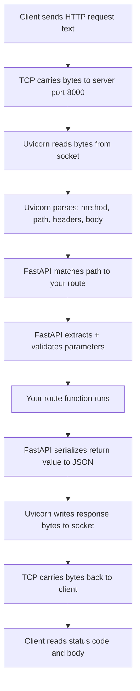
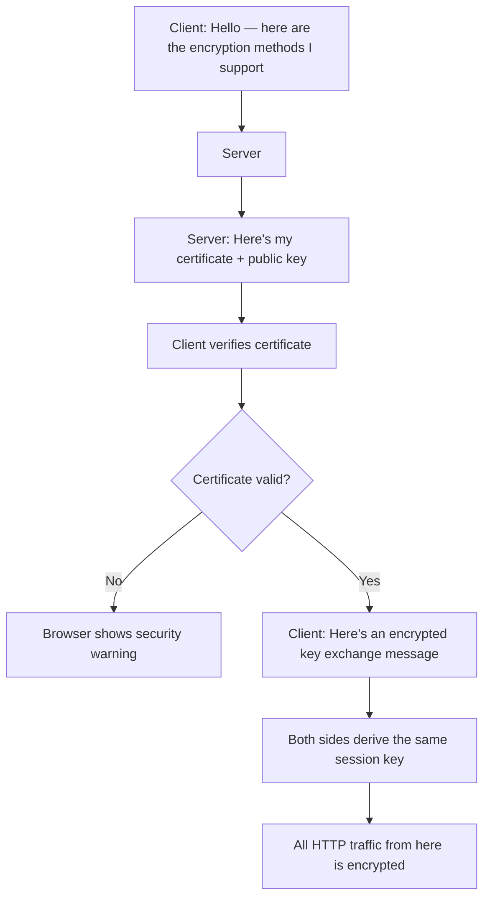
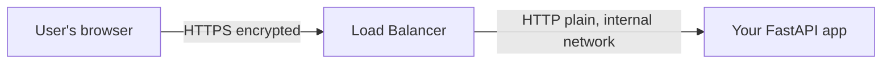

import { Callout } from 'fumadocs-ui/components/callout';

# HTTP vs HTTPS

Every time you hit `/docs` and send a request, you're using HTTP. FastAPI speaks it natively. But what *is* HTTP — what's actually travelling between the client and your server?

---

## HTTP Is Just Text

**HTTP** (HyperText Transfer Protocol) is a text-based, request-response protocol. A protocol is an agreed format — like how a letter has "To:", "From:", a body, and a sign-off. Both sides follow the same rules so they can understand each other.

When you send `GET /matches/3` from Swagger UI, this is literally what travels over the wire:

```
GET /matches/3 HTTP/1.1
Host: 127.0.0.1:8000
Accept: application/json
User-Agent: Mozilla/5.0

```

Plain text. Nothing more. Let's break it down.

---

## Anatomy of an HTTP Request

```
GET /matches/3 HTTP/1.1       ← Request line
Host: 127.0.0.1:8000          ← Headers (one per line)
Accept: application/json
User-Agent: Mozilla/5.0
                               ← Blank line separates headers from body
                               ← No body for GET requests
```

**The request line** has three parts:

```
GET        /matches/3      HTTP/1.1
 ↑              ↑              ↑
Method        Path          Version
```

- **Method** — what action to take (`GET`, `POST`, `PATCH`, `DELETE`)
- **Path** — which resource (`/matches/3`)
- **Version** — which HTTP version (`HTTP/1.1`)

**Headers** are metadata — key-value pairs that tell the server about the request. `Host` says which server, `Accept` says what format the client wants back, `User-Agent` identifies who's making the request.

**The blank line** is required — it signals where headers end. For `POST` requests, the body comes after it:

```
POST /matches HTTP/1.1
Host: 127.0.0.1:8000
Content-Type: application/json
Content-Length: 97
Accept: application/json
                                         ← blank line
{"home_team": "Arsenal", "away_team": "Chelsea", "sport": "football", "date": "2026-05-10", "status": "upcoming"}
```

`Content-Type: application/json` tells FastAPI how to parse the body. `Content-Length` tells it how many bytes to read.

---

## Anatomy of an HTTP Response

After your route function returns, FastAPI builds a response:

```
HTTP/1.1 200 OK                               ← Status line
content-type: application/json                ← Headers
content-length: 152

{"id":3,"home_team":"lakers","away_team":"warriors","sport":"basketball","date":"2025-11-15","status":"completed","winner":"home_team"}
```

**The status line:**

```
HTTP/1.1     200      OK
   ↑          ↑        ↑
Version     Code    Reason
```

The **status code** tells the client immediately what happened — `200` success, `404` not found, `422` validation error. You've used these all course. The client checks this before reading the body.

---

## The Full Request Journey

Here's what happens between you hitting "Execute" in Swagger and your route function running:



Your code only runs at step 7. Everything else is Uvicorn and FastAPI.

---

## The Problem: HTTP Is Readable by Anyone

When you're developing on `http://127.0.0.1:8000`, traffic only travels between your browser and a server on the same machine — it never leaves your computer. Fine.

In production, your server is somewhere on the internet. Those plain text bytes travel through cables, routers, and ISP infrastructure. And **anyone sitting on the network path can read them.**

Imagine your API had a login endpoint. The raw request would look like this:

```
POST /auth/login HTTP/1.1
Host: api.myapp.com

{"email": "user@example.com", "password": "hunter2"}
```

That password is right there — readable by:
- Anyone on the same Wi-Fi network (coffee shop, airport, hotel)
- Your ISP
- Any router the packets pass through
- Anyone running packet-capture software nearby

This is a **man-in-the-middle attack** — a third party between client and server reads or modifies traffic without either side knowing.

<Callout type="error" title="Never use plain HTTP in production">
  For any API handling user data, authentication tokens, or anything sensitive — plain HTTP is unacceptable. A user logging in from a coffee shop is completely exposed.
</Callout>

---

## HTTPS: HTTP Inside an Encrypted Tunnel

**HTTPS** is not a different protocol. It's HTTP wrapped inside **TLS** (Transport Layer Security). TLS creates an encrypted tunnel before any HTTP data flows. Inside that tunnel, the requests and responses look exactly the same — they're just encrypted so nobody outside the tunnel can read them.

The `S` in HTTPS stands for Secure. URL changes from `http://` to `https://`, default port changes from `80` to `443`.

### What TLS Gives You

| Property | What it means |
|----------|--------------|
| **Encryption** | Data is scrambled — eavesdroppers see random bytes |
| **Integrity** | Data can't be modified in transit without detection |
| **Authentication** | Client can verify it's talking to the real server |

---

## The TLS Handshake

Before any HTTP data flows, client and server perform a brief back-and-forth to establish encryption:



The whole thing takes milliseconds. After it, normal HTTP flows — just encrypted.

---

## What Is a Certificate?

During the handshake, the server sends a **TLS certificate** — a digital document proving its identity.

A certificate contains:
- The **domain name** it's valid for (`api.myapp.com`)
- The server's **public key** (used in the handshake)
- An **expiry date**
- A **digital signature** from a Certificate Authority

### Certificate Authorities

A **Certificate Authority (CA)** is a trusted third party that has verified the certificate holder actually owns the domain. Your browser ships with a built-in list of ~100 trusted CAs. When it receives a certificate, it checks the CA's signature. If valid — and the domain matches, and it hasn't expired — the connection proceeds.

<Callout type="info" title="Let's Encrypt">
  **Let's Encrypt** is a free, non-profit CA. Platforms like Railway, Render, and Fly.io use it to automatically provision certificates for your deployed apps. You almost never manage certificates manually.
</Callout>

**Self-signed certificates** (ones you create yourself with no CA) trigger browser warnings: "I can't verify this is really the server it claims to be." Fine for local development — never for production.

---

## What HTTPS Protects (and What It Doesn't)

**HTTPS does protect:**
- ✅ Request and response bodies (your JSON payloads, passwords, tokens)
- ✅ Headers (including `Authorization` headers with API keys)
- ✅ The URL path and query string (`/matches/3?status=upcoming` is encrypted)
- ✅ Data integrity — nobody can silently alter your data in transit

**HTTPS does NOT protect:**
- ❌ **Who the client is** — HTTPS only authenticates the server. User authentication (tokens, API keys) is still your app's job
- ❌ **The fact that a connection is being made** — someone can see you're connecting to `api.myapp.com`, just not what you're sending
- ❌ **A compromised server** — if your server is hacked, HTTPS doesn't help
- ❌ **A compromised client** — malware on the user's device bypasses HTTPS entirely

---

## Your Code Doesn't Change

HTTPS changes the transport layer — not the HTTP protocol. Everything you know about methods, status codes, headers, and JSON bodies is identical for both HTTP and HTTPS.

Your FastAPI code doesn't change at all. In production, **TLS termination** happens at the infrastructure level:



The load balancer (provided by your deployment platform) handles encryption and decryption. Your Uvicorn server only sees plain HTTP — but on a private internal network, not the public internet. This is fine.

Railway, Render, and Fly.io all do this automatically. You deploy your app, they assign a domain with automatic HTTPS. Your code doesn't change.

---

## HTTP Versions

You may see version numbers mentioned:

| Version | Year | Key difference |
|---------|------|----------------|
| **HTTP/1.1** | 1997 | One request at a time per connection. Text-based. What you've been using. |
| **HTTP/2** | 2015 | Multiple requests simultaneously over one connection. Binary. Much faster for web pages loading many resources. |
| **HTTP/3** | 2022 | Built on QUIC instead of TCP. Faster on unreliable networks. Still being adopted. |

Methods, status codes, headers, and body formats are the same across all versions. Uvicorn handles version negotiation automatically — your code doesn't change.

---

## Summary

| | HTTP | HTTPS |
|-|------|-------|
| Transport | Plain text | Encrypted via TLS |
| Default port | 80 | 443 |
| Certificate required | No | Yes |
| Safe for passwords | ❌ | ✅ |
| Your code changes | — | No |
| Use in production | ❌ Never | ✅ Always |

---

## What's Next

Now you understand what travels between client and server. The next lesson covers REST — the design conventions that make APIs predictable and consistent, and why your API is structured the way it is.
