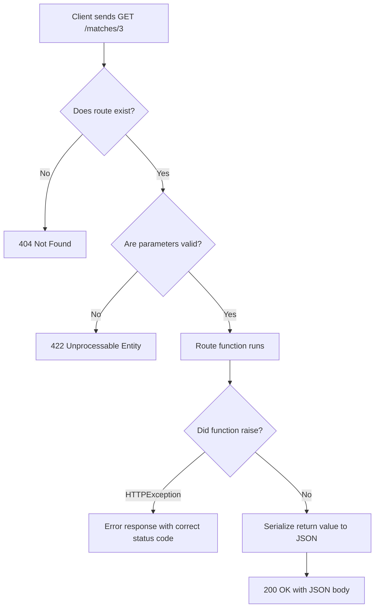

import { Callout } from 'fumadocs-ui/components/callout';

# What Is a REST API?

"REST API" appears in every job posting and every framework's documentation. You've been building one since lesson one — but what does the term actually mean?

---

## Before REST: The Problem

In the early 2000s, there were no agreed conventions for web APIs. Teams invented their own styles:

```
GET  /getUser?id=5
POST /createUser
POST /deleteUser?id=5
POST /updateUserEmail?id=5&email=new@example.com
POST /getUserMatches?userId=5&status=completed
```

To use an API like this, you had to read its specific documentation for every single action. There was no pattern to learn — every endpoint was its own invention.

**REST** changed this by saying: use the conventions already baked into HTTP itself. URLs identify *things*. HTTP methods express *actions*. Status codes communicate *outcomes*.

---

## The Core Idea: Resources

The central concept in REST is the **resource** — any noun your API exposes.

In your sports API, the resources are:
- A collection of matches
- A single match
- A match's lineup

Resources are identified by **URLs**. The URL is the resource's permanent address.

```
/matches              ← the collection of all matches
/matches/3            ← the specific match with ID 3
/matches/3/players    ← the players in match 3
```

<Callout type="info" title="URLs are nouns, not verbs">
  `/matches/3` means "the match resource with ID 3." It doesn't mean "run getMatch." The URL identifies a *thing*, not a command.
</Callout>

**Correct:**
```
✅  /matches
✅  /matches/3
✅  /matches/3/players
```

**Incorrect:**
```
❌  /getMatch?id=3       ← verb in the URL
❌  /deleteMatch/3       ← verb in the URL
❌  /matches/3/fetch     ← verb in the URL
```

---

## HTTP Methods as Actions

HTTP already has a set of well-defined methods. REST uses them as the action vocabulary:

| Method | Meaning | Your API |
|--------|---------|---------|
| `GET` | Read — no side effects | `GET /matches/3` → return match 3 |
| `POST` | Create a new resource | `POST /matches` → create a match |
| `PUT` | Replace entirely | `PUT /matches/3` → replace all of match 3 |
| `PATCH` | Partial update | `PATCH /matches/3` → update some fields |
| `DELETE` | Remove | `DELETE /matches/3` → delete match 3 |

The same URL handles different operations depending on the method:

```
GET    /matches/3   → return match 3
PATCH  /matches/3   → update match 3
DELETE /matches/3   → delete match 3
```

This is why a developer who's never seen your API before can look at `DELETE /orders/42` and immediately know what it does. There's a shared vocabulary.

---

## Test: Spot the Non-RESTful Patterns

Look at these endpoints. What's wrong with each?

```
POST /matches/3/delete
GET  /matches/create
POST /getMatchDetails
```

<Callout type="warn" title="Problems">
  - `POST /matches/3/delete` → should be `DELETE /matches/3`. The action is in the URL, not the method.
  - `GET /matches/create` → `GET` requests should only read. Creating uses `POST /matches`.
  - `POST /getMatchDetails` → should be `GET /matches/{id}`. GET is for reading, and "get" is a verb in the URL.
</Callout>

---

## The Two Rules That Matter Most

REST has six formal constraints, but two shape day-to-day design decisions:

### Rule 1: Stateless

**Every request must contain all the information the server needs. The server remembers nothing between requests.**

A stateful approach (what you want to avoid):
```
Request 1: POST /login  {"email": "...", "password": "..."}
Server: "OK, I'll remember session abc123 is logged in."

Request 2: GET /my-matches
Server: "Let me check session abc123... yep, logged in. Here are their matches."
```

The server remembers state between requests. This breaks horizontal scaling — if request 1 went to Server A, request 2 must also go to Server A.

A stateless approach:
```
Request 1: GET /matches
Headers: Authorization: Bearer eyJhbGci...my_token

Request 2: GET /matches/3
Headers: Authorization: Bearer eyJhbGci...my_token  ← same token, every request
```

Every request carries its own credentials. Any server can handle any request. Add 50 servers behind a load balancer — it doesn't matter which one handles each request.

Your sports API is naturally stateless — each request contains the match ID or filters it needs. No session required.

### Rule 2: Uniform Interface

**Use the same conventions everywhere.**

If `GET /matches/3` returns a single match, then `GET /teams/7` should return a single team. If `DELETE /matches/3` deletes match 3, then `DELETE /teams/7` should delete team 7.

Consistency makes APIs learnable. A developer who understands one resource can predict how all other resources work.

---

## CRUD and HTTP Methods

**CRUD** (Create, Read, Update, Delete) maps directly to HTTP methods:

| CRUD | HTTP Method | Example |
|------|-------------|---------|
| **C**reate | `POST` | `POST /matches` |
| **R**ead | `GET` | `GET /matches`, `GET /matches/3` |
| **U**pdate | `PUT` / `PATCH` | `PUT /matches/3`, `PATCH /matches/3` |
| **D**elete | `DELETE` | `DELETE /matches/3` |

Your API has full CRUD for matches. Every new resource you add should follow this same pattern.

---

## URL Design in Practice

### Use plural nouns for collections

```
✅  /matches      ✅  /teams      ✅  /players
❌  /match        ❌  /team       ❌  /player
```

Pick plural and be consistent.

### Nest resources to show relationships

```
GET  /matches/3/players      ← all players in match 3
GET  /matches/3/players/10   ← player #10 in match 3
POST /matches/3/players      ← add a player to match 3
```

Don't go deeper than two levels — URLs get unwieldy:
```
❌  /leagues/1/seasons/2/rounds/3/matches/4/players/5
✅  /matches/4/players/5
```

### Query parameters are for filtering, sorting, and pagination

Query parameters control *which* resources to return — not which resource you're addressing:

```
# Filtering
GET /matches?sport=football&status=upcoming

# Pagination
GET /matches?page=2&limit=20

# Sorting
GET /matches?sort=date&order=asc

# Combined
GET /matches?sport=football&page=1&limit=10
```

Omitting them returns everything unfiltered — they refine the collection, they don't change which resource you're talking about.

---

## Status Codes Are Part of the Contract

You've used status codes all course. In REST they're not optional — they're a promise to every client, monitoring tool, and API gateway in the world.

### Status code categories

| Range | Meaning | Examples |
|-------|---------|---------|
| `2xx` | Success | 200 OK, 201 Created, 204 No Content |
| `3xx` | Redirect | 301 Moved Permanently |
| `4xx` | Client error | 400 Bad Request, 401 Unauthorized, 403 Forbidden, 404 Not Found, 422 Unprocessable |
| `5xx` | Server error | 500 Internal Server Error |

### The ones you'll use most

| Code | Name | When |
|------|------|------|
| `200` | OK | Default success |
| `201` | Created | Successful POST — new resource created |
| `204` | No Content | Success but no body (some DELETE implementations) |
| `400` | Bad Request | Malformed request — wrong JSON syntax |
| `401` | Unauthorized | Not authenticated — no token provided |
| `403` | Forbidden | Authenticated but not permitted |
| `404` | Not Found | Resource doesn't exist |
| `422` | Unprocessable Entity | Valid JSON but logically invalid data |
| `500` | Internal Server Error | Bug on the server — client can't fix this |

### The mistake everyone makes

```python
# ❌ Wrong — hiding an error inside a 200
@app.get("/matches/{match_id}")
def get_match(match_id: int):
    match = find_match(match_id)
    if match is None:
        return {"error": "Match not found"}   # This returns 200 OK!
    return match
```

Every HTTP client, load balancer, and monitoring tool checks the status code first. A `200` with `{"error": "..."}` in the body looks like success to all of them.

```python
# ✅ Correct — status code communicates the outcome
if match is None:
    raise HTTPException(status_code=404, detail="Match not found")
```

---

## How a REST Request Flows



---

## REST vs Other API Styles

REST isn't the only option. Here's what you'll encounter:

### GraphQL

One endpoint (`/graphql`). Clients send a query describing exactly the data shape they want:

```graphql
query {
  match(id: 3) {
    homeTeam
    awayTeam
    homeLineup { name position }
  }
}
```

Good for complex, nested data where different clients need different shapes. Used by GitHub, Shopify. Harder to start with — REST is simpler.

### gRPC

Uses binary encoding (Protocol Buffers) instead of JSON. Calls look like regular function calls. Much faster than REST. Not human-readable, requires code generation. Used for high-performance service-to-service communication inside companies.

### SOAP

Older XML-based protocol. Found in banks, government, healthcare. Verbose and rigid. You'll consume them when integrating with legacy systems, but you won't build new ones.

**When to use REST:** Almost always, for web and mobile app backends. It's the right default.

---

## Summary: The REST Checklist

```
✅  URLs are nouns, not verbs      /matches/3  not  /getMatch?id=3
✅  HTTP methods express actions   DELETE /matches/3  not  POST /matches/3/delete
✅  Stateless requests             Every request carries its own credentials
✅  Consistent patterns            Same structure for every resource
✅  Status codes are correct       404 for missing, 201 for created, never 200+error
✅  Query params for filtering     /matches?sport=football  not  /footballMatches
```

---

## What's Next

You understand what REST is and why your API is structured the way it is. The next lesson covers classes and objects — what's actually happening when you write `class Match(BaseModel)` and how Pydantic uses Python's class system to do its work.
