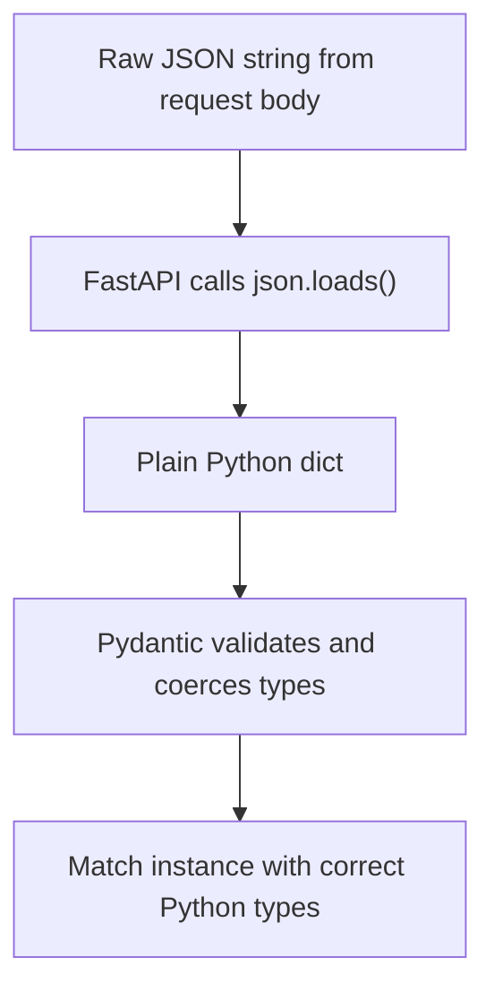
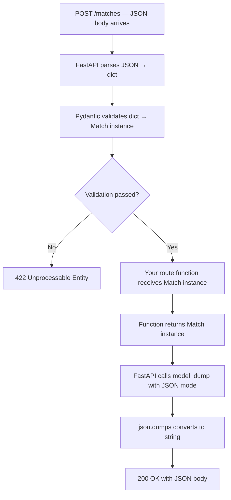

import { Callout } from 'fumadocs-ui/components/callout';

# JSON & Serialization

When your route function returns a `Match` object, what actually gets sent to the client? Not a Python object — those only exist in memory. What travels over HTTP is a **JSON string**. Converting between Python objects and JSON strings is called **serialization** (Python → JSON) and **deserialization** (JSON → Python).

Pydantic handles this for you automatically. But you need to understand what's happening to debug errors, design responses intentionally, and handle edge cases correctly.

---

## What JSON Is

**JSON** (JavaScript Object Notation) is a text format for structured data. Despite the name, it has nothing to do with JavaScript — it's the universal standard for web API data exchange.

JSON has exactly **six value types**. Not more:

```json
{
  "name": "Arsenal",
  "founded": 1886,
  "win_rate": 0.62,
  "is_active": true,
  "nickname": null,
  "trophies": ["Premier League", "FA Cup", "Champions League"]
}
```

That's the complete list:

| JSON type | Example |
|-----------|---------|
| string | `"Arsenal"` |
| number | `1886`, `0.62` |
| boolean | `true`, `false` |
| null | `null` |
| array | `[1, 2, 3]` |
| object | `{"key": "value"}` |

**There are no dates. There are no enums. There are no custom objects.**

This is the root cause of every serialization challenge you'll encounter.

---

## Python → JSON: The Type Mapping

Python has more types than JSON. When converting, there's a standard mapping:

| Python | JSON |
|--------|------|
| `dict` | object `{}` |
| `list`, `tuple` | array `[]` |
| `str` | string |
| `int`, `float` | number |
| `True` / `False` | `true` / `false` |
| `None` | `null` |
| `datetime.date` | ❌ no equivalent |
| `Enum` member | ❌ no equivalent |
| Pydantic model | ❌ no equivalent |

The bottom three have no JSON equivalent. They need to be converted to something JSON understands before you can serialize them.

---

## Python's `json` Module

Python's standard library has a `json` module for basic conversion.

### `json.dumps` — Python to JSON string

```python
import json

data = {
    "home_team": "Arsenal",
    "id": 3,
    "is_completed": True,
    "winner": None,
    "score": [2, 1]
}

result = json.dumps(data)
print(result)
# '{"home_team": "Arsenal", "id": 3, "is_completed": true, "winner": null, "score": [2, 1]}'

print(type(result))   # <class 'str'>
```

Note what changed: `True` → `true`, `None` → `null`. The result is a plain string.

For readable output while debugging:

```python
print(json.dumps(data, indent=2))
# {
#   "home_team": "Arsenal",
#   "id": 3,
#   ...
# }
```

### `json.loads` — JSON string to Python

```python
raw = '{"home_team": "Arsenal", "id": 3, "is_completed": true, "winner": null}'

data = json.loads(raw)
print(data)
# {'home_team': 'Arsenal', 'id': 3, 'is_completed': True, 'winner': None}

print(type(data["id"]))            # <class 'int'>
print(type(data["is_completed"]))  # <class 'bool'>  ← "true" became True
print(type(data["winner"]))        # <class 'NoneType'>  ← "null" became None
```

### Files: `json.dump` and `json.load`

```python
# Write to file (no 's')
with open("matches.json", "w") as f:
    json.dump(data, f, indent=2)

# Read from file (no 's')
with open("matches.json", "r") as f:
    data = json.load(f)
```

`dumps`/`loads` = strings. `dump`/`load` = files.

---

## The Problem: Types `json` Can't Handle

Try serializing a `datetime.date`:

```python
from datetime import date
import json

data = {"home_team": "Arsenal", "date": date(2025, 10, 21)}

json.dumps(data)
# TypeError: Object of type date is not JSON serializable
```

Try serializing an enum:

```python
from enum import Enum

class Status(Enum):
    completed = "completed"

data = {"status": Status.completed}

json.dumps(data)
# TypeError: Object of type Status is not JSON serializable
```

Try serializing a Pydantic model directly:

```python
match = Match(home_team="Arsenal", ...)

json.dumps(match)
# TypeError: Object of type Match is not JSON serializable
```

All three crash with the same error — Python's `json` module doesn't know what to do with these types.

<Callout type="info" title="Why str Enums work differently">
  Your enums inherit from `str`: `class Sport(str, Enum)`. Because a `str` enum member IS a string, Python's `json` module can serialize it without error — it just uses the string value. A plain `class Status(Enum)` without `str` inheritance will crash. This is one of the reasons you use `(str, Enum)`.
</Callout>

---

## How Pydantic Fixes This

Pydantic knows how to convert all of its supported types into JSON-safe values. There are two versions of `.model_dump()`:

### `.model_dump()` — Python dict (still has Python types)

```python
match = Match(
    id=1,
    home_team="Arsenal",
    away_team="Chelsea",
    sport=Sport.football,
    date=date(2025, 10, 21),
    status=Status.completed,
    winner=Winner.home_team,
)

data = match.model_dump()
print(data)
# {
#   'id': 1,
#   'home_team': 'arsenal',
#   'sport': <Sport.football: 'football'>,    ← still an enum member
#   'date': datetime.date(2025, 10, 21),       ← still a date object
#   'status': <Status.completed: 'completed'>, ← still an enum member
#   ...
# }
```

Useful when you need a dict for Python operations — like the merge pattern in PATCH:

```python
stored_data = existing_match.model_dump()    # Python dict with Python types
update_data = update.model_dump(exclude_unset=True)
merged = {**stored_data, **update_data}      # dict merge works fine
```

### `.model_dump(mode='json')` — JSON-serializable dict

```python
data = match.model_dump(mode='json')
print(data)
# {
#   'id': 1,
#   'home_team': 'arsenal',
#   'sport': 'football',      ← string
#   'date': '2025-10-21',     ← ISO date string
#   'status': 'completed',    ← string
#   'winner': 'home_team',    ← string
#   ...
# }
```

Now everything is JSON-safe. You could pass this to `json.dumps()` without error.

FastAPI calls the equivalent of this internally when sending a response — you return the model object and FastAPI handles the conversion. You don't call it yourself for normal responses.

---

## The `exclude_unset=True` Option

You used this in your PATCH implementation:

```python
update = MatchUpdate(venue="Wembley Stadium")

print(update.model_dump())
# {'venue': 'Wembley Stadium', 'date': None, 'status': None, 'winner': None}

print(update.model_dump(exclude_unset=True))
# {'venue': 'Wembley Stadium'}
```

Without `exclude_unset=True`, the dump includes all `Optional` fields with their defaults (`None`). With it, only the fields the client explicitly sent are included.

This matters for PATCH:

```python
# ❌ Without exclude_unset — overwrites everything with None
merged = {**stored_data, **update.model_dump()}
# stored winner="home_team" gets overwritten with winner=None

# ✅ With exclude_unset — only touches what the client sent
merged = {**stored_data, **update.model_dump(exclude_unset=True)}
# stored winner="home_team" is preserved
```

---

## The `exclude_none=True` Option

Strips `None` values from the output — used in `response_model_exclude_none=True` on your route decorators:

```python
data = match.model_dump(exclude_none=True)
# Fields where value is None are omitted entirely
```

This keeps API responses clean — clients don't receive a field full of `null` values for things they didn't ask about.

---

## Deserialization: JSON → Pydantic Model

The reverse journey — when a client POSTs a request body:



After step D:

```
"football"     →  Sport.football        (string → enum member)
"2025-10-21"   →  datetime.date(...)    (string → date object)
"upcoming"     →  Status.upcoming       (string → enum member)
"  Arsenal  "  →  "arsenal"             (field_validator normalized it)
```

After deserialization, `match.date` is a real `datetime.date` — you can do arithmetic on it. `match.sport` is a real `Sport` enum member — you can compare it with `match.sport == Sport.football`.

### `model_validate()` for dicts

When you already have a Python dict and want a validated Pydantic model:

```python
data = {
    "home_team": "Arsenal",
    "away_team": "Chelsea",
    "sport": "football",
    "date": "2025-10-21",
    "status": "upcoming"
}

match = Match.model_validate(data)
# All types coerced and all validators run — identical to parsing from JSON
```

You used this in PATCH to revalidate after merging:

```python
merged = {**stored_data, **update_data}
validated_match = Match.model_validate(merged)   # ensures merged result is valid
```

---

## How FastAPI Uses All of This

When a POST request arrives:



Your code only touches the `Match` instance — you never call `json.dumps` yourself. FastAPI handles the full conversion pipeline in both directions.

---

## Writing and Reading JSON Files

For cases where you want to persist data (save to disk instead of in-memory):

```python
import json
from pathlib import Path

def save_matches(matches: list[Match], filepath: str):
    data = [m.model_dump(mode='json') for m in matches]
    with open(filepath, 'w') as f:
        json.dump(data, f, indent=2)

def load_matches(filepath: str) -> list[Match]:
    with open(filepath, 'r') as f:
        data = json.load(f)
    return [Match.model_validate(item) for item in data]
```

`model_dump(mode='json')` before writing — converts Python types to JSON-safe types. `model_validate()` after reading — reconstructs validated `Match` instances from the dicts.

---

## Debugging Serialization

If you're getting serialization errors or unexpected response shapes, always check what `.model_dump()` and `.model_dump(mode='json')` actually return:

```python
match = Match(...)
print(match.model_dump())              # Python types — anything unexpected?
print(match.model_dump(mode='json'))   # JSON types — this is what clients receive
```

The difference between the two outputs tells you exactly what Pydantic is converting.

---

## Summary

| Method | Returns | Use when |
|--------|---------|---------|
| `.model_dump()` | Python dict with Python types | Dict operations, merging (PATCH pattern) |
| `.model_dump(mode='json')` | Dict with JSON-safe types | Saving to file, passing to `json.dumps` |
| `.model_dump(exclude_unset=True)` | Only explicitly-set fields | PATCH — don't overwrite unset fields |
| `.model_dump(exclude_none=True)` | Fields with non-None values | Clean API responses |
| `Match.model_validate(dict)` | Validated `Match` instance | Creating a model from an existing dict |
| `json.dumps(data)` | JSON string | Writing JSON manually |
| `json.loads(text)` | Python dict | Parsing JSON manually |

---

## What's Next

You now understand the full data pipeline — from JSON string to Python object and back. The next lesson covers decorators — the `@` syntax you've been using on every route and every validator, and what it's actually doing.
