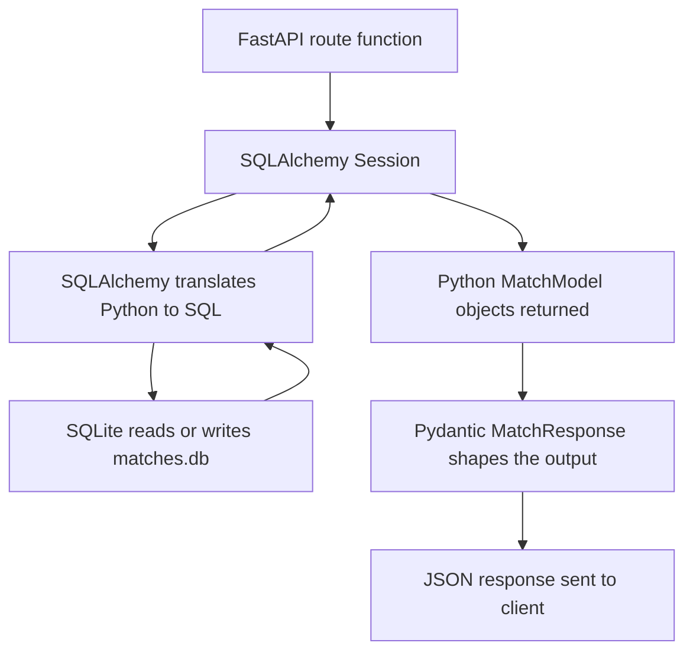

import { Callout } from 'fumadocs-ui/components/callout';

# SQLAlchemy & ORMs

You could write raw SQL strings inside your route functions. That would work. But there's a better approach — an ORM.

---

## What an ORM Is

**ORM** stands for Object-Relational Mapper. It's a library that lets you work with a database using Python objects instead of writing SQL strings by hand.

Without an ORM, fetching a match by ID looks like this:

```python
import sqlite3

conn = sqlite3.connect("matches.db")
cursor = conn.cursor()
cursor.execute("SELECT * FROM matches WHERE id = ?", (match_id,))
row = cursor.fetchone()
conn.close()

# manually reconstruct a Python object from a raw tuple
match = {
    "id": row[0],
    "home_team": row[1],
    "away_team": row[2],
    # ... column by column
}
```

With SQLAlchemy ORM, the same operation is:

```python
match = db.get(MatchModel, match_id)
```

The ORM writes the SQL, runs it, and hands you back a Python object. You stay in Python the whole time.

---

## Tables Are Python Classes

In a relational database, data lives in **tables**. A `matches` table looks like this:

| id | home_team | away_team | sport | status | winner |
|----|-----------|-----------|-------|--------|--------|
| 1 | arsenal | chelsea | football | completed | draw |
| 2 | lakers | warriors | basketball | completed | home_team |
| 3 | india | pakistan | cricket | completed | home_team |

Each **row** is one match. Each **column** is one field. Every row has the same columns.

With SQLAlchemy, you define this table as a Python class:

```python
from sqlalchemy.orm import DeclarativeBase, Mapped, mapped_column
from sqlalchemy import String, Date

class Base(DeclarativeBase):
    pass

class MatchModel(Base):
    __tablename__ = "matches"

    id: Mapped[int] = mapped_column(primary_key=True, autoincrement=True)
    home_team: Mapped[str] = mapped_column(String(50))
    away_team: Mapped[str] = mapped_column(String(50))
    sport: Mapped[str] = mapped_column(String(20))
    status: Mapped[str] = mapped_column(String(20))
    winner: Mapped[str | None] = mapped_column(String(20), nullable=True)
```

This class definition tells SQLAlchemy:
- Create a table called `matches`
- These are the columns, and these are their types
- `id` is the primary key — the unique identifier, assigned automatically by the database
- `winner` can be `NULL` (no winner yet)

SQLAlchemy reads this class and creates the actual table in your database.

---

## MatchModel vs Match — Two Different Things

You already have a `Match` class in `app/models.py`. The SQLAlchemy class we're creating is `MatchModel`. They'll look similar but serve completely different purposes:

| | `Match` (Pydantic) | `MatchModel` (SQLAlchemy) |
|-|-------------------|--------------------------|
| Lives in | `app/models.py` | `app/db_models.py` |
| Inherits from | `BaseModel` | `Base` (SQLAlchemy) |
| Purpose | Validate HTTP input, shape HTTP output | Define the DB table, read/write rows |
| Has validators | Yes | No |
| Knows about HTTP | Yes | No |
| Knows about SQL | No | Yes |

<Callout type="info" title="Why keep both?">
  Pydantic models are great at validation — required fields, length constraints, cross-field business rules. SQLAlchemy models are great at talking to a database. They're different tools for different jobs. Trying to use one class for both creates a mess.
</Callout>

The data flows between them in both directions:

```
POST body (JSON)
    → Pydantic Match (validate)
    → MatchModel (save to DB)

MatchModel (read from DB)
    → Pydantic MatchResponse (shape for response)
    → JSON response
```

---

## The Session: Your Gateway to the Database

Every database operation in SQLAlchemy goes through a **Session**. Think of it as a single conversation with the database — you open one, do your work, and close it when you're done.

```python
with Session(engine) as db:
    match = db.get(MatchModel, 3)    # SELECT by primary key
    db.add(new_match)                # stage an INSERT
    db.delete(match)                 # stage a DELETE
    db.commit()                      # write all staged changes permanently
```

Changes aren't written to disk until you call `db.commit()`. If something goes wrong before that, you can call `db.rollback()` to undo everything. This is the **transaction** system — all changes succeed together, or none of them do.

In FastAPI, one session will be opened per request and closed when the request finishes — regardless of whether it succeeded or raised an exception.

---

## How It Fits Together



Your route functions work with Python objects the whole time. SQLAlchemy handles every translation to and from SQL.

---

## What's Next

Let's install SQLAlchemy, create the database connection, and define the `MatchModel` table.
