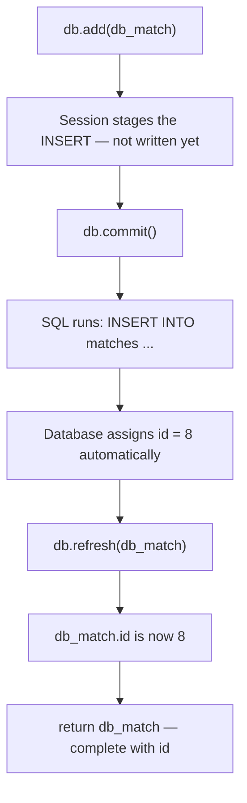

import { Callout } from 'fumadocs-ui/components/callout';

# POST Route — Inserting into the Database

The GET routes read. The POST route writes. Writing introduces three new operations: `db.add()`, `db.commit()`, and `db.refresh()`.

---

## The Write Pattern

Every database write in SQLAlchemy follows the same structure:

```python
db.add(db_match)      # 1. stage the change
db.commit()           # 2. write to disk permanently
db.refresh(db_match)  # 3. re-read the row (picks up auto-generated values)
return db_match
```

`db.add()` tells the session about the new object — it doesn't write anything yet. `db.commit()` is when the SQL actually runs and the data hits the disk. `db.refresh()` re-reads the row from the database, which populates any values the database assigned automatically — like the auto-incremented `id`.

---

## Step 1 — Update `create_match`

### Before

```python title="Before"
@router.post("", response_model=MatchResponse, response_model_exclude_none=True, status_code=status.HTTP_201_CREATED)
def create_match(match: Annotated[Match, Body(openapi_examples={...})]):
    if match.status is Status.upcoming and match.date < dt_date.today():
        raise HTTPException(
            status_code=status.HTTP_422_UNPROCESSABLE_ENTITY,
            detail="Upcoming match date cannot be in the past",
        )
    match.id = INITIAL_DATA[-1].id + 1
    INITIAL_DATA.append(match)
    return match
```

### After

```python title="After"
@router.post("", response_model=MatchResponse, response_model_exclude_none=True, status_code=status.HTTP_201_CREATED)
def create_match(
    match: Annotated[Match, Body(openapi_examples={...})],
    db: Annotated[Session, Depends(get_db)],  # !mark
):
    if match.status is Status.upcoming and match.date < dt_date.today():
        raise HTTPException(
            status_code=status.HTTP_422_UNPROCESSABLE_ENTITY,
            detail="Upcoming match date cannot be in the past",
        )

    db_match = MatchModel(              # !mark
        home_team=match.home_team,      # !mark
        away_team=match.away_team,      # !mark
        venue=match.venue,              # !mark
        date=match.date,                # !mark
        sport=match.sport.value,        # !mark
        status=match.status.value,      # !mark
        winner=match.winner.value if match.winner else None,  # !mark
    )                                   # !mark

    db.add(db_match)       # !mark
    db.commit()            # !mark
    db.refresh(db_match)   # !mark
    return db_match
```

### What changed — and why

**Removed:** `match.id = INITIAL_DATA[-1].id + 1`

The database assigns the ID automatically via `autoincrement=True`. We don't set it. We don't calculate it. We don't need to.

**Removed:** `INITIAL_DATA.append(match)`

Replaced by the three-line write pattern.

**Added:** constructing a `MatchModel` from the validated `Match`

The route receives a `Match` (Pydantic). The database needs a `MatchModel` (SQLAlchemy). You bridge them by creating a new `MatchModel` and copying the fields:

```python
db_match = MatchModel(
    home_team=match.home_team,
    sport=match.sport.value,      # ← enum member → string
    winner=match.winner.value if match.winner else None,  # ← enum or None
    ...
)
```

The `.value` calls convert enum members to strings — `Sport.football` becomes `"football"`, which is what the database column stores.

---

## Walking Through the Three-Step Write



Without `db.refresh()`, `db_match.id` would still be `None` after the commit — Python doesn't automatically know what ID the database assigned. `db.refresh()` re-reads the row and fills it in.

---

## Test It

POST a new match in `/docs`:

```json title="POST /matches"
{
  "home_team": "Arsenal",
  "away_team": "Chelsea",
  "sport": "football",
  "date": "2026-08-01",
  "status": "upcoming",
  "venue": "Emirates Stadium"
}
```

Response:

```json title="201 Created"
{
  "id": 1,
  "home_team": "arsenal",
  "away_team": "chelsea",
  "sport": "football",
  "date": "2026-08-01",
  "status": "upcoming",
  "venue": "emirates stadium"
}
```

Now stop the server (`Ctrl+C`) and restart it. Then:

```
GET /matches/1
```

```json title="200 OK"
{
  "id": 1,
  "home_team": "arsenal",
  "away_team": "chelsea",
  ...
}
```

**It survived the restart.** That's the whole point.

---

## What's Next

POST works — you can insert and retrieve data. Now update PATCH, PUT, and DELETE to use the database too.
