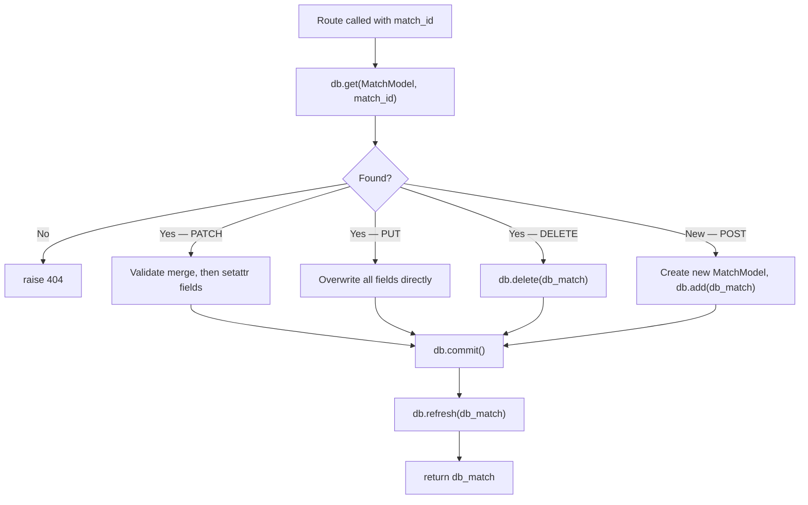

import { Callout } from 'fumadocs-ui/components/callout';

# PATCH, PUT & DELETE — Updating and Removing Rows

Updates and deletes follow a simple pattern: fetch the row, modify it (or mark it for deletion), then commit. SQLAlchemy tracks changes to model attributes automatically — you don't need to tell it which fields changed.

---

## Step 1 — Update `update_match` (PATCH)

PATCH applies a partial update — only the fields the client explicitly sent.

### Before

```python title="Before"
def update_match(match_id, update, ...):
    for i, match in enumerate(INITIAL_DATA):
        if match.id == match_id:
            stored_match_data = match.model_dump()
            update_data = update.model_dump(exclude_unset=True)
            updated_match_dict = {**stored_match_data, **update_data}
            try:
                validated_match = Match.model_validate(updated_match_dict)
            except ValueError as e:
                raise HTTPException(status_code=422, detail=str(e))
            INITIAL_DATA[i] = validated_match
            return validated_match
    raise HTTPException(status_code=404, detail="Match not found")
```

### After

```python title="After"
@router.patch("/{match_id}", response_model=MatchResponse, response_model_exclude_none=True)
def update_match(
    match_id: Annotated[int, Path(ge=1, title="Match ID")],
    update: MatchUpdate,
    db: Annotated[Session, Depends(get_db)],  # !mark
):
    db_match = db.get(MatchModel, match_id)  # !mark
    if db_match is None:
        raise HTTPException(status_code=status.HTTP_404_NOT_FOUND, detail="Match not found")

    # Only the fields the client explicitly sent
    update_data = update.model_dump(exclude_unset=True)

    # Validate the merged result before writing — same business rules as before
    stored_as_dict = {
        "id": db_match.id,
        "home_team": db_match.home_team,
        "away_team": db_match.away_team,
        "venue": db_match.venue,
        "date": db_match.date,
        "sport": db_match.sport,
        "status": db_match.status,
        "winner": db_match.winner,
    }
    merged = {**stored_as_dict, **update_data}
    try:
        Match.model_validate(merged)  # !mark
    except ValueError as e:
        raise HTTPException(
            status_code=status.HTTP_422_UNPROCESSABLE_ENTITY,
            detail=str(e),
        )

    # Apply updates to the database model's attributes
    for field, value in update_data.items():         # !mark
        if hasattr(db_match, field):                 # !mark
            db_value = value.value if hasattr(value, "value") else value  # !mark
            setattr(db_match, field, db_value)       # !mark

    db.commit()           # !mark
    db.refresh(db_match)  # !mark
    return db_match
```

### Understanding the update loop

```python
for field, value in update_data.items():
    if hasattr(db_match, field):
        db_value = value.value if hasattr(value, "value") else value
        setattr(db_match, field, db_value)
```

`update_data` might be `{"status": Status.completed, "winner": Winner.home_team}`. The loop:

1. `field = "status"`, `value = Status.completed`
2. `hasattr(db_match, "status")` → True — `MatchModel` has a `status` column
3. `Status.completed` has `.value` → extract `"completed"`
4. `setattr(db_match, "status", "completed")` — sets `db_match.status = "completed"`

SQLAlchemy watches `MatchModel` attribute changes. When you do `setattr(db_match, "status", "completed")`, the session registers this as a pending UPDATE. `db.commit()` runs the SQL:

```sql
UPDATE matches SET status = 'completed', winner = 'home_team' WHERE id = 3
```

<Callout type="info" title="No INITIAL_DATA[i] = validated_match needed">
  With in-memory lists, you had to find the index and replace the whole item. With SQLAlchemy, you fetch the object, modify its attributes, and commit. SQLAlchemy knows which row to update because it tracks the primary key.
</Callout>

---

## Step 2 — Update `replace_match` (PUT)

PUT replaces the entire match. No merging — every field is overwritten from the incoming data.

### Before

```python title="Before"
for i, match in enumerate(INITIAL_DATA):
    if match.id == match_id:
        match.id = match_id
        INITIAL_DATA[i] = match
        return match
raise HTTPException(status_code=404, detail="Match not found")
```

### After

```python title="After"
@router.put("/{match_id}", response_model=MatchResponse, response_model_exclude_none=True)
def replace_match(
    match_id: Annotated[int, Path(ge=1, title="Match ID")],
    match: Annotated[Match, Body(...)],
    db: Annotated[Session, Depends(get_db)],  # !mark
):
    db_match = db.get(MatchModel, match_id)  # !mark
    if db_match is None:
        raise HTTPException(status_code=status.HTTP_404_NOT_FOUND, detail="Match not found")

    # Overwrite every field
    db_match.home_team = match.home_team    # !mark
    db_match.away_team = match.away_team    # !mark
    db_match.venue = match.venue            # !mark
    db_match.date = match.date              # !mark
    db_match.sport = match.sport.value      # !mark
    db_match.status = match.status.value    # !mark
    db_match.winner = match.winner.value if match.winner else None  # !mark

    db.commit()           # !mark
    db.refresh(db_match)  # !mark
    return db_match
```

Same pattern as POST — copy fields from `Match` (Pydantic) to `MatchModel` (SQLAlchemy), extract `.value` from enum fields, commit.

---

## Step 3 — Update `delete_match` (DELETE)

### Before

```python title="Before"
for i, match in enumerate(INITIAL_DATA):
    if match.id == match_id:
        deleted_match = INITIAL_DATA.pop(i)
        return deleted_match
raise HTTPException(status_code=404, detail="Match not found")
```

### After

```python title="After"
@router.delete("/{match_id}", response_model=MatchResponse, response_model_exclude_none=True)
def delete_match(
    match_id: Annotated[int, Path(ge=1, title="Match ID")],
    db: Annotated[Session, Depends(get_db)],  # !mark
):
    db_match = db.get(MatchModel, match_id)  # !mark
    if db_match is None:
        raise HTTPException(status_code=status.HTTP_404_NOT_FOUND, detail="Match not found")

    db.delete(db_match)  # !mark
    db.commit()          # !mark
    return db_match      # return the deleted match's data (still in Python memory)
```

`db.delete(db_match)` stages the DELETE. `db.commit()` runs it. After the commit, the row is gone from the database — but `db_match` still exists as a Python object in memory, so you can still `return db_match` to confirm what was deleted.

---

## The Complete Write Pattern

All three write operations follow the same flow:



---

## Test the Full CRUD Cycle

With all routes updated, test the complete lifecycle:

**Create:**
```
POST /matches  →  201  {"id": 1, "home_team": "arsenal", ...}
```

**Read:**
```
GET /matches/1  →  200  {"id": 1, ...}
```

**Partial update:**
```
PATCH /matches/1  body: {"status": "completed", "winner": "home_team"}  →  200
```

**Verify update:**
```
GET /matches/1  →  {"status": "completed", "winner": "home_team", ...}
```

**Delete:**
```
DELETE /matches/1  →  200  {"id": 1, ...}
```

**Verify deleted:**
```
GET /matches/1  →  404  {"detail": "Match not found"}
```

**Restart and verify persistence:**
```
POST another match → Ctrl+C → restart → GET /matches → still there ✓
```

---

## What's Next

All six routes work with the database. But the database starts empty every time — there's no equivalent to `INITIAL_DATA` anymore. The next lesson adds a seed script.
