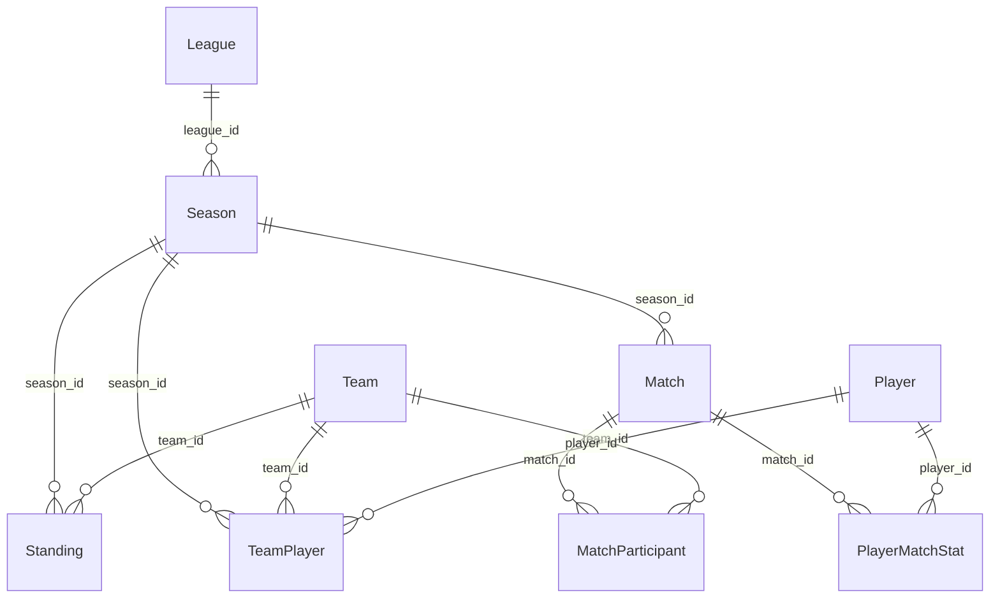

import { Callout } from 'fumadocs-ui/components/callout';

# Foreign Keys — Connecting Tables

You know how to declare columns. Now let's connect tables to each other.

A **foreign key** is a column in one table that holds the `id` of a row in another table. It's how you say "this match belongs to this season" or "this standing belongs to this team."

---

## The Problem Without Foreign Keys

Imagine storing the team name directly in `match_participants`:

```
id | match_id | team_name | score
---+----------+-----------+------
1  | 1        | Arsenal   | 1
2  | 1        | Chelsea   | 2
```

This looks fine until:
- Arsenal gets renamed → you have to update hundreds of rows
- Someone types "Arsenel" by mistake → you have inconsistent data
- You want to look up Arsenal's stadium → you'd have to join on the team name string, which is slow

**Foreign keys solve all of this.** Instead of storing the name, you store the `id`:

```
id | match_id | team_id | score
---+----------+---------+------
1  | 1        | 1       | 1
2  | 1        | 2       | 2
```

Now:
- Renaming Arsenal means updating one row in `teams`
- Typos are impossible — `team_id` must exist in `teams`
- Looking up stadium info is fast — join on integer IDs

---

## Declaring a Foreign Key in SQLAlchemy

Foreign keys are declared using `ForeignKey(...)` inside `mapped_column`:

```python
from sqlalchemy import ForeignKey
from sqlalchemy.orm import Mapped, mapped_column

class Season(Base):
    __tablename__ = "seasons"

    id: Mapped[int] = mapped_column(primary_key=True)
    league_id: Mapped[int] = mapped_column(ForeignKey("leagues.id"))
    year: Mapped[int]
    start_date: Mapped[dt_date]
    end_date: Mapped[dt_date]
```

`ForeignKey("leagues.id")` takes a string in the format `"table_name.column_name"`. This tells the database: the value in `league_id` must exist as an `id` in the `leagues` table.

---

## What the String Format Means

```python
ForeignKey("leagues.id")
#           ↑        ↑
#     table name   column name
```

This always references the **database table name** (from `__tablename__`), not the Python class name. So it's `"leagues.id"` not `"League.id"`.

Here are all the foreign keys in our models:

```python
# Season belongs to a League
league_id: Mapped[int] = mapped_column(ForeignKey("leagues.id"))

# Match belongs to a Season
season_id: Mapped[int] = mapped_column(ForeignKey("seasons.id"))

# TeamPlayer links Team + Player + Season
team_id: Mapped[int] = mapped_column(ForeignKey("teams.id"))
player_id: Mapped[int] = mapped_column(ForeignKey("players.id"))
season_id: Mapped[int] = mapped_column(ForeignKey("seasons.id"))

# MatchParticipant links Match + Team
match_id: Mapped[int] = mapped_column(ForeignKey("matches.id"))
team_id: Mapped[int] = mapped_column(ForeignKey("teams.id"))

# PlayerMatchStat links Match + Player
match_id: Mapped[int] = mapped_column(ForeignKey("matches.id"))
player_id: Mapped[int] = mapped_column(ForeignKey("players.id"))

# Standing belongs to Season + Team
season_id: Mapped[int] = mapped_column(ForeignKey("seasons.id"))
team_id: Mapped[int] = mapped_column(ForeignKey("teams.id"))
```

---

## What the Database Enforces

Foreign keys are not just a convention — they're a **constraint** the database enforces.

If you try to insert a `Season` with `league_id = 999` and there's no `League` with `id = 999`, the database will **reject the insert** with an error. This is called **referential integrity** — the database guarantees that references are always valid.

Similarly, if you try to delete a `League` that has `Season` rows pointing to it, the database will refuse (by default) — you'd be leaving those seasons pointing at a league that no longer exists.

<Callout type="info" title="Referential integrity in SQLite">
  SQLite (a common development database) doesn't enforce foreign keys by default — you have to explicitly enable them with `PRAGMA foreign_keys = ON`. PostgreSQL and MySQL enforce them by default. For production applications, always use a database that enforces them.
</Callout>

---

## A Foreign Key Is Just an Integer Column

It's important to understand that a foreign key column is just a regular integer column with an extra constraint. In Python, you access it like any other attribute:

```python
season = session.get(Season, 1)
print(season.league_id)   # 3  ← just an integer
```

If you want the actual `League` object — not just the ID — you need a `relationship()`. That's the next lesson.

---

## The Direction of Foreign Keys

Foreign keys always go on the **"many" side** of a relationship. Let's think about it:

- One `League` has many `Seasons` → `league_id` goes on `Season`
- One `Season` has many `Matches` → `season_id` goes on `Match`
- One `Team` has many `Standings` → `team_id` and `season_id` go on `Standing`

You can think of it like this: **the row that "belongs to" something else holds the foreign key.**

```
League (id=1)          ← no FK needed here
   ↑
Season (league_id=1)   ← FK points up to League
   ↑
Match (season_id=2)    ← FK points up to Season
```

---

## Multiple Foreign Keys in One Table

Some tables have more than one foreign key. The `TeamPlayer` table is a good example:

```python
class TeamPlayer(Base):
    __tablename__ = "team_players"

    id: Mapped[int] = mapped_column(primary_key=True)

    team_id: Mapped[int] = mapped_column(ForeignKey("teams.id"))
    player_id: Mapped[int] = mapped_column(ForeignKey("players.id"))
    season_id: Mapped[int] = mapped_column(ForeignKey("seasons.id"))

    jersey_number: Mapped[int | None]
```

This table is a **junction table** — its whole purpose is to connect three other tables together. It represents the idea: "Player X played for Team Y in Season Z wearing jersey number N."

Three foreign keys, one row per roster entry. This is a very common pattern in relational databases.

---

## Visualising the Foreign Keys in Our Schema



Every line with an arrow is a foreign key. The arrow always points from the many-side table (which holds the FK column) toward the one-side table (which owns the referenced `id`).

---

## Foreign Keys vs `relationship()`

It's easy to confuse these two. Here's the clear distinction:

| | What it is | What it gives you |
|--|------------|------------------|
| `ForeignKey("leagues.id")` | A database constraint | An integer column in the DB |
| `relationship("League")` | A Python-level link | The actual Python object |

```python
# ForeignKey — gives you the integer ID
season.league_id   # 3

# relationship — gives you the actual object
season.league      # <League id=3 name='Premier League'>
season.league.name # 'Premier League'
```

You almost always want both: the foreign key for the database constraint, and the relationship for convenient Python access. The next lesson covers relationships in full detail.

---

## Summary

| Concept | What it means |
|---------|--------------|
| Foreign key | A column that holds the `id` of a row in another table |
| `ForeignKey("table.column")` | SQLAlchemy declaration of a foreign key |
| Referential integrity | The database rejects inserts/deletes that would break FK references |
| Junction table | A table with multiple FKs that connects several tables together |
| FK goes on the "many" side | The table that "belongs to" another holds the foreign key |

---

## What's Next

You understand foreign keys at the database level. The next lesson covers `relationship()` — how SQLAlchemy lets you navigate from one Python object to another across those foreign key links.
